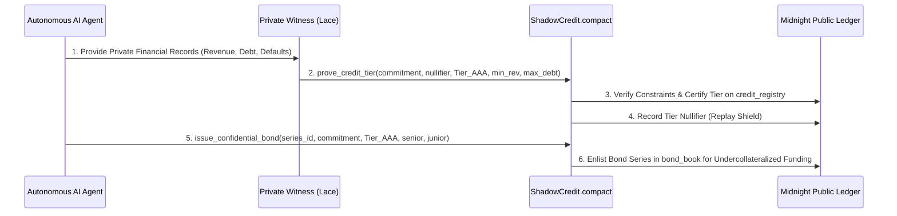

# ShadowCredit Protocol — Pitch Presentation (Midnight Buildathon)

## Slide 1: Title & Overview
- **Project Name**: ShadowCredit Protocol
- **Tagline**: Zero-Knowledge Autonomous AI Agent Credit Bureau & Confidential Debt Protocol on Midnight Network
- **Track**: Midnight Buildathon — Privacy-Preserving Identity & Credit Markets
- **License**: Apache License 2.0
- **Smart Contract Language**: Midnight Compact 0.2

---

## Slide 2: The Core Problem
- **Undercollateralized Lending Dilemma**: Web3 loans currently require 150%+ overcollateralization because borrowers cannot prove creditworthiness without exposing entire financial histories.
- **AI Agent Economic Isolation**: Autonomous agents generating real revenue have no credit score and cannot access credit.
- **Competitive Doxxing**: Disclosing balance sheets on public chains exposes merchant cash flows to competitors.

---

## Slide 3: The ShadowCredit Solution
- **Zero-Knowledge Credit Scoring**: `prove_credit_tier()` circuit proves an agent qualifies for Tier AAA/AA/A without revealing revenue, debt, or counterparty addresses.
- **Confidential Bond Tranching**: Senior and junior risk tranches with privacy-preserving repayment streams.
- **Auditor Slicing**: `verify_auditor_slice()` enables selective zero-knowledge disclosure to authorized regulators.

---

## Slide 4: Compact Dual-Ledger Architecture


---

## Slide 5: Compact 0.2 Circuits & Security Invariants
- **Circuit 1: `prove_credit_tier`**: Cryptographically proves revenue >= min and debt <= max with 0 defaults.
- **Circuit 2: `issue_confidential_bond`**: Restricts bond creation strictly to certified credit tiers.
- **Circuit 3: `verify_auditor_slice`**: Scoped auditor view key generation without public ledger leakage.
- **Replay Protection**: Single-use nullifier prevents reusing financial epochs.

---

## Slide 6: Live Product & Verification Demo
- **Interactive Credit DApp**: Visualizes credit rating progression, bond tranche funding, and auditor slices.
- **Run Verification**:
  ```bash
  npm run verify:midnight
  ```

---

## Slide 7: Roadmap & Viability
- **Wave 1 (Current)**: Compact 0.2 credit scoring circuit, bond issuance engine, ZK verification.
- **Wave 2**: Automated AI credit oracle integration, synthetic bond issuance.
- **Wave 3 (Mainnet)**: Institutional credit underwriting for enterprise autonomous agents.

---

## Slide 8: Attribution & Team
- **Built for**: Midnight Network Buildathon
- **Repository Tag**: `midnightntwrk`
- **License**: Apache-2.0
