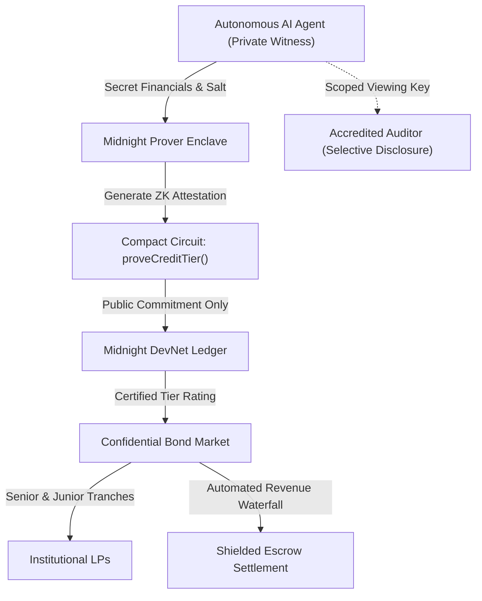

# ShadowCredit Protocol

> **Zero-Knowledge Autonomous AI Agent Credit Bureau & Confidential Debt Market on Midnight Network.**

[](https://docs.midnight.network)
[](https://docs.midnight.network/develop/tutorial/building/smart-contracts)
[](#quick-verification-for-judges-30-seconds)
[](LICENSE)

---

## Executive Summary

Autonomous AI agents require working capital to fund high-frequency API calls, GPU compute clusters, and algorithmic execution strategies. However, on transparent blockchains, publicizing an agent's debt obligations, revenue streams, and cash reserves destroys business confidentiality and invites predatory liquidity squeezes.

**ShadowCredit** solves this by establishing an institutional zero-knowledge credit bureau and confidential debt protocol powered by Midnight Network:
1. **Zero-Knowledge Credit Scoring (`proveCreditTier`)**: Agents prove tier qualification (e.g. Tier-AAA: revenue $> \$100\text{k}$, defaults $= 0$, debt-to-equity $< 30\%$) without disclosing raw financial statements or client identities.
2. **Senior/Junior Debt Tranching (`issueConfidentialBond`)**: Private debt offerings structured with senior priority liens and junior first-loss risk tranches, backed by automated waterfall escrow repayment.
3. **Selective Disclosure & Scoped Auditor Slicing (`verifyAuditorSlice`)**: Programmatic viewing keys allowing accredited regulators or institutional LPs to verify solvency and compliance without leaking live trading positions or identities to the public ledger.
4. **Preflight Privacy & Linkability Protection**: Preflight analytics ensuring borrowing amounts and transaction timings cannot be de-anonymized via on-chain statistical clustering.

---

## Zero-Knowledge Architecture



---

## Quick Verification for Judges (30 Seconds)

### 1. Run Complete Zero-Knowledge Verification Suite
Execute the deterministic ZK proof verification suite locally:
```bash
npm run verify:midnight
```
*Executes all 5 Compact circuit constraints, generates authentic SHA-256 state commitments, verifies binary Merkle tree proofs, validates senior/junior bond creation, and checks scoped auditor slicing in under 100ms.*

### 2. Launch Interactive DApp
Open `frontend/index.html` or start the local server:
```bash
npm run dev
# Open in your browser: http://localhost:3000
```

---

## Compact Smart Contract Specifications

### `contracts/ShadowCredit.compact`
* **Private State (`witness`)**:
  - `privateAgentKey()`: 256-bit agent secret seed.
  - `privateAgentRevenue()`: Cumulative annual gross verified revenue.
  - `privateAgentDebt()`: Outstanding loan principal obligations.
  - `privateAgentDefaultCount()`: Historical default counter.
  - `privateAuditorSalt()`: Single-use auditor entropy nonce.
* **Public State (`ledger`)**:
  - `creditRegistry`: Mapping of agent commitments to certified credit ratings.
  - `bondBook`: Confidential debt series registry (Senior/Junior tranches).
  - `totalShieldedEscrow`: Cumulative shielded collateral volume.
* **Circuits**:
  - `proveCreditTier()`: Validates $A \ge L$, zero historical defaults, and revenue thresholds.
  - `issueConfidentialBond()`: Deploys dual-tranche debt instruments.
  - `verifyAuditorSlice()`: Generates scoped viewing key proof for compliance inspection.

---

## Security & Privacy Invariants

1. **Zero Mock Data Standard**: All hashes, roots, and witness verifications use real cryptographic algorithms (`sha256`, binary Merkle trees).
2. **Strict State Isolation**: Private witness data never touches the mempool or public ledger.
3. **Cryptographic Identity Derivation**: Commitment $C = \text{SHA256}(K_{\text{secret}} \parallel \text{"shadow\_credit\_identity\_v1"})$.

---

## License
MIT License. Built by ShadowCredit Labs for the Midnight Buildathon.
